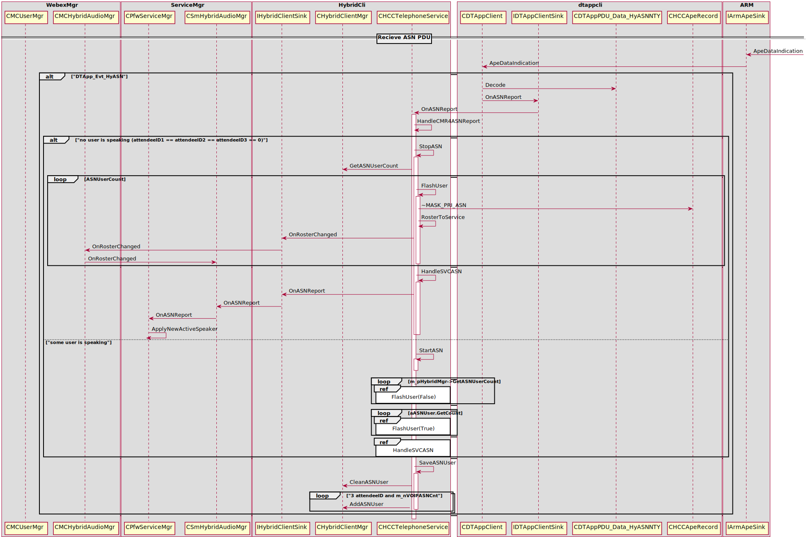

F1447 Multi Stream Audio Introduction 
=====================================

Capture Source ID (CSI)
-----------------------

A Capture Source ID (CSI) is used to uniquely identify a physical media capture source as 
a camer or microphones within an RTP session.

Win Client interact with **CB Memory Cache** 
--------------------------------------------

#. Win Client **Allocate** and **Subscribe** *CB Memory Cache*

	.. image:: _static/cmr4_csi_cache_seq.svg

#. InitMyAudioCSIInfo
	+ CSmHybridAudioMgr::OnSessionCreateConfirm
	+ CSmHybridAudioMgr::OnSessionCreateIndication

#. Win Client send **VOIP CSI** to **CB Memory Cache**

	.. image:: _static/cmr4_csi_voip_wme_to_cfw_seq.svg

#. CSI Payload Format

	* Format for Audio::
		
		<?xml version="1.0" encoding="UTF-8"?>
		<CMR>
		<Version>1.0</Version>
		<User>
			<AttendeeID>%d</AttendeeID>
			<NodeID>%d</NodeID>
			<UserType>%d</UserType>
		</User>
		<CSIs>
			<CSI type="audio">%s</CSI>
		</CSIs>
		</CMR>

	* Format for Video::
		
		<?xml version="1.0" encoding="UTF-8"?>
		<CMR>
			<Version>1.0</Version>
			<User>
				<AttendeeID>%d</AttendeeID>
				<NodeID>%d</NodeID>
				<UserType>%d</UserType>
			</User>
			<CSIs>
				<CSI type="video">%s</CSI> (ZERO mean: 0xff,ff,ff,ff)
			</CSIs>
		</CMR>

	* Format for Sharing::
		
		<?xml version="1.0" encoding="UTF-8"?>
		<CMR>
			<Version>1.0</Version>
			<User>
			<AttendeeID>%d</AttendeeID>
			<NodeID>%d</NodeID>
			<UserType>%d</UserType>
			</User>
			<CSIs>
				<CSI type="sharing">%s</CSI> (ZERO mean: 0xff,ff,ff,ff)
			</CSIs>
		</CMR>

* WebEx PC Client notify TS or TPGW its **CMR Client Version**
	
	#. When PC Client notify TS or TPGW
	
		+ CAtConfAgent::TryAvailableCBSvr
			- IConferenceContext::GetULONG(**CONF_CONTEXT_VMR_FLAG_ID**)
			- CConfRosterInfoPDU::GenerateXMLPDU
		+ CAtConfAgent::AgentEnroll
			- IConferenceContext::GetULONG(**CONF_CONTEXT_VMR_FLAG_ID**)
			- CConfRosterInfoPDU::GenerateXMLPDU

	#. What's the **CMR Client Version** format::
	
		<CMgr ver="1.0">
			<UAID>521</UAID>
			<CS>0</CS>
			<FG>20</FG>
			<EA>ciscotp@cisco.com</EA>
			<PG>94976</PG>
			<UT>4</UT>
			<CLID>385</CLID>
			<ASVideoBandwidth>768</ASVideoBandwidth>
			<ASVideoProfileLevelId>4382733</ASVideoProfileLevelId>
			<ASVideoMaxMbps>18000</ASVideoMaxMbps>
			<ASVideoMaxFs>9000</ASVideoMaxFs>
			<CMRClientVersion>4</CMRClientVersion>
		</CMgr>

Receive **CSI** from **CB Cache** then pass to **WME**
------------------------------------------------------

.. image:: _static/cmr4_csi_voip_cfw_to_wme_seq.svg

Receive **ASN** from **TA** then pass to **CFW**
------------------------------------------------------

Presenter broadcast **ASN**
---------------------------

Attendee receive **ASN**
------------------------

PList class diagram
-------------------

.. image:: _static/mc_plist_class_diagram.svg

Key Points
----------

#. CPfwServiceMgr::ApplyNewActiveSpeaker
#. CPfwServiceMgr::OnASNPduFromCB
#. CPfwServiceMgr::BeASNSelector
#. CPfwServiceMgr::BroadcastASNPDU
#. CMCUserMgr::StartAnimateIcon
#. CMCUserMgr::StartAnimate
#. CMCUserListSink::StartAnimate
#. CMCPListSelfBar::SyncDummyUserASNInfo
#. CPfwAudioMgr::SetActiveSpeakerList

Repo
----

* webex-conference-mgr
* webex-framework-reskin
* webex-windows-mc
* webex-audioclient
* webex-windows-hybridaudio
* webex-mmp-sdk

