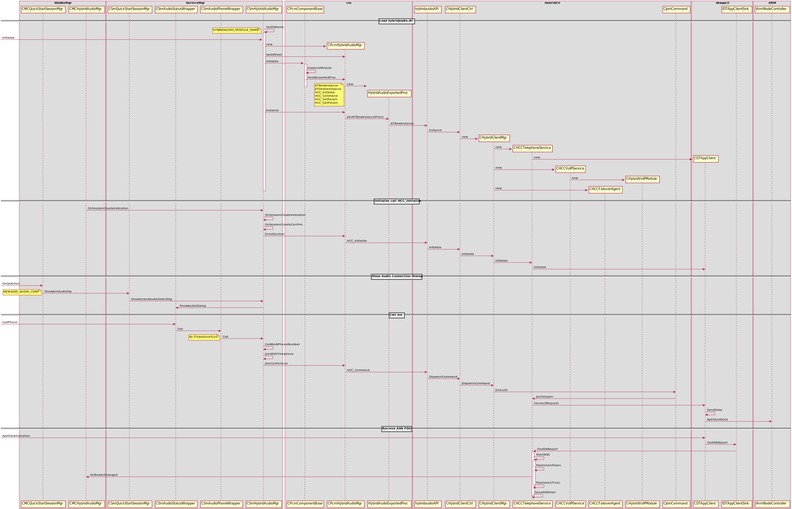
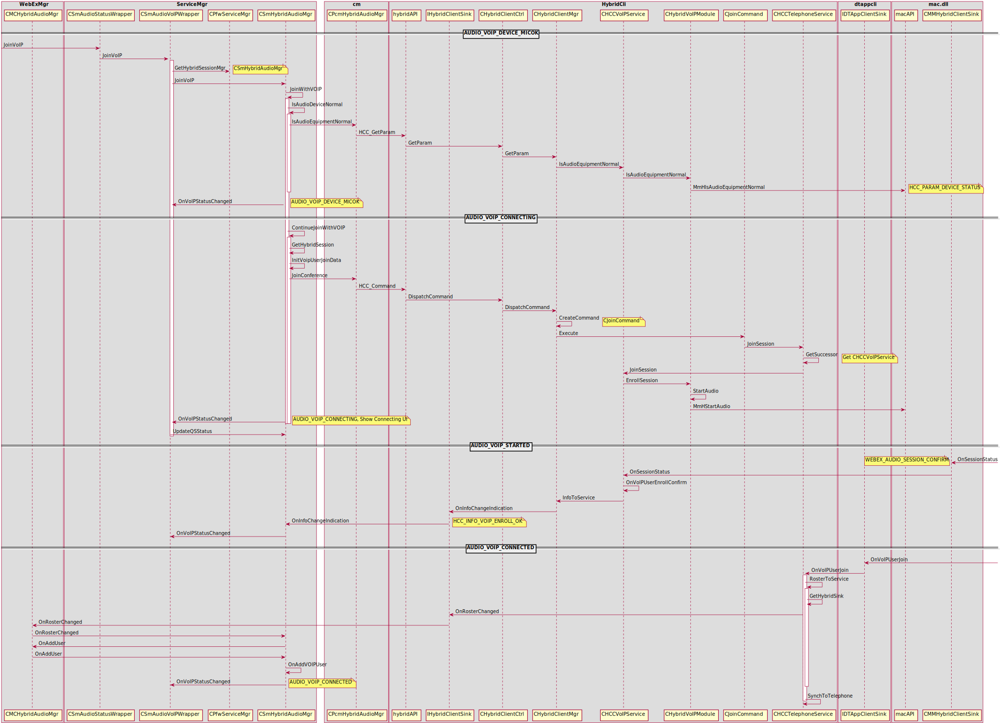

CMR4
====

Sequence for **CSI** 
--------------------

.. image:: _static/cmr4_csi_seq.svg

Sequence for **Hybridaudio** 
----------------------------

User List of **Hybirdaudio** and **audioclient**

.. image:: _static/hybridaudio_userlist.svg

How PList show active speaking and how it retrieve active speaking info?

.. image:: _static/plist_asn_seq.svg

CSI of VOIP
-----------

* When **CFW** receive a **CSI** from **CB Cache**, how pass to **WME** ?

.. image:: _static/cmr4_csi_voip_cfw_to_wme_seq.svg

* When **WME** generate a new **CSI**, how pass to **CFW**
	+ Check point
		CSmCSIMgr::UploadMyCSIInfoToCB Audio

.. image:: _static/cmr4_csi_voip_wme_to_cfw_seq.svg

VOIP Session Call Flow
----------------------

* VOIP Session Call Flow

Checkpoint
----------

#. Allocate cache request send out?
	CSmCacheMgr::AllocacheHandle
#. Cache subscribe success ?
	CSmCacheMgr::OnNamehandleAllocateConfirm cacheName
#. Subscribe request send out?
	CSmCacheMgr::Subscribe
#. Receive Cache data
	CSmCSIMgr::CSmCacheMgr::HandleRetrieveData
#. Video CSI conflict
	CMmSVideoClient::NotifyCSItoCFW
#. HybridFlag, CSmTelephonyMgr, CSmHybridAudioMgr
	CConfCongextMgr::GetHybridFlag $HybridFlag
#. CMR4 Flag
	CConfContextMgr::GetCMRVersion >= 4 (**$CMRVersion**), **CMRVersion** (in webex.ini)

CSI Payload Format
------------------

* Format for Audio

| <?xml version="1.0" encoding="UTF-8"?>
| <CMR>
| 	<Version>1.0</Version>
| 	<User>
| 		<AttendeeID>%s</AttendeeID>
| 		<NodeID>%s</NodeID>
| 		<UserType>%d</UserType>
| 	</User>
| 	<CSIs>
| 		<CSI type="audio">%s</CSI>
| 	</CSIs>
| </CMR>

* Format for Video

| <?xml version="1.0" encoding="UTF-8"?>
| <CMR>
| 	<Version>1.0</Version>
| 	<User>
| 		<AttendeeID>%s</AttendeeID>
| 		<NodeID>%s</NodeID>
| 		<UserType>%d</UserType>
| 	</User>
| 	<CSIs>
| 		<CSI type="video">%s</CSI> (ZERO mean: 0xff,ff,ff,ff)
| 	</CSIs>
| </CMR>

* Format for Sharing

| <?xml version="1.0" encoding="UTF-8"?>
| <CMR>
| 	<Version>1.0</Version>
| 	<User>
| 		<AttendeeID>%s</AttendeeID>
| 		<NodeID>%s</NodeID>
| 		<UserType>%d</UserType>
| 	</User>
| 	<CSIs>
| 		<CSI type="sharing">%s</CSI> (ZERO mean: 0xff,ff,ff,ff)
| 	</CSIs>
| </CMR>

* Webex new client will use the roster information to notify TS or TP Gateway whether it is a new client:

| <CMgr ver="1.0">
| 	<UAID>521</UAID>
| 	<CS>0</CS>
| 	<FG>20</FG>
| 	<EA>ciscotp@cisco.com</EA>
| 	<PG>94976</PG>
| 	<UT>4</UT>
| 	<CLID>385</CLID>
| 	<ASVideoBandwidth>768</ASVideoBandwidth>
| 	<ASVideoProfileLevelId>4382733</ASVideoProfileLevelId>
| 	<ASVideoMaxMbps>18000</ASVideoMaxMbps>
| 	<ASVideoMaxFs>9000</ASVideoMaxFs>
| 	<CMRClientVersion>4</CMRClientVersion>
| </CMgr>

Test Case
---------

#. Simple case

	* Telephone
		+ Pure Phone ()
		+ WebEx Phone ()
		+ CMR4 Phone ()
	* VOIP
	* Spark 
#. Composite case

	* Telephone + VOIP
	* Telephone + Spark
	* VOIP + Spark
	* Telephone + VOIP + Spark

Repo
----

* webex-conference-mgr
* webex-framework-reskin
* webex-windows-mc
* webex-mmp-sdk
* webex-windows-hybridaudio ??

WIKI
----

* http://wikicentral.cisco.com/display/PROJECT/T31R2+CMR+4+Main+Wiki
* UE & UI
	https://cisco.app.box.com/s/a5rp0ro2zsd48j1bpxpum95do4a6rldi/1/5774998729/57200310457/1
* UE for client side
	https://cisco.box.com/s/c5w1vxidxeyf779ihv7aam8lpcaqd7dp
* UE for page side
	https://cisco.box.com/s/zdbpy39v6qyh0zxsctl65grijmcg1udg
* TIMS
	+ http://tims.cisco.com/
	+ WebEx
	+ Project => Select Project => Browse All Projects => T31R2 => Click **OK**

Test Env
--------

#. http://gohm.qa.webex.com/ admin/Aa1234
#. Test site for Active Speaker & Multi-Streaming
	|	Site: https://sqdemo.dmz.webex.com
	|	Account: lizzy/P@ss1234
	|	Please use my admin to create your own site. 
#. From *Hilary Liu*
	|	Site: https://t29pmrp1.qa.webex.com
	|	Account: con/P@ss1234
#. SparkSetup.msi \\10.224.188.12\csg-hgh-VSCM-Vanoris\QiuJin\SparkSetup.msi
#. DMZ site
	sqdemo4.dmz.webex.com (admin/P@ss1234)
#. @2016-04-11 
	http://t29pmrf1.qa.webex.com/   (con/P@ss1234)
#. freepbx Media Server, X-Lite

X-Lite 
------

#. Account name: 3070
#. User ID: 3070
#. Domain: 10.224.188.16
#. Password: 3070
#. Display name: 3070
#. Authorization name: 3070

How to join the TP-GATEWAY
--------------------------

* Use **Chrome** browser: In the **settings -> extension -> get more extension** download the **DHC rest client** and install
* First API is **http: 10.224.194.145/sparkgateway/api/v1/conference** use the **POST** 

	#. In the request fill: **HTTP://10.224.194.145/sparkgateway/api/v1/conference**
	#. In the header fill: 
		+ Content-Type: application/json
		+ Cisco-Locus-ID: sssss
		+ TrackingID: sssss
	#. In the body fill::
	
		{
			"conferenceId":"4278337500_8612",
			"callbackURL":"https://hecate11-a.wbx2.com/hecate/api/v1/sgw_conferences/4278337500_8612"
		}
		
		Replace "4278337500" with the real "confid"
	#. Click Send

* Second API is **10.224.194.145:80/sparkgateway/api/v1/conference/4278337500_8612/participant**  with **PUT**

	#. Body content fill with::
	
		{
			"url":"https://locus-a.wbx2.com/locus/api/v1/loci/f3201b2d-322d-3c07-a7c1-96ae4daf04d1",
			"created":"2015-05-27T20:14:27.416Z",
			"info":{"topic":"","maxParticipants":25,"webExMeetingId":4278343850},
			"host":{"id":"3269f390-b389-456e-920e-1ecd9b0a2bb0","email":"lvtang@cisco.com","name":"Elton Tang (lvtang)"},
			"fullState":{"active":true,"count":1,"locked":false,"lastActive":"2015-07-21T06:56:46.638Z"},
			"participants":[
			
			{
				"isCreator":false,
				"id":"692fcecc-0752-3cf0-b400-74061cd577d4",
				"url":"https://locus-a.wbx2.com/locus/api/v1/loci/f3201b2d-322d-3c07-a7c1-96ae4daf04d1/participant/692fcecc-0752-3cf0-b400-74061cd577d4",
				"state":"JOINED",
				"type":"RESOURCE_ROOM",
				"person":{"id":"692fcecc-0752-3cf0-b400-74061cd577d4","email":"20TmDd2vSGRGeso03fzbL1iA@ss4.webex.com","name":"DummyTandberg","sipUrl":"sip:20TmDd2vSGRGeso03fzbL1iA@ss4.webex.com"},
				"devices":[{"url":"https://l2sip-cfa-web.wbx2.com/l2sip/api/v1/calls/6ecd58cfa5240da4ecbc65a9efeaa500@67.23.43.22/10.181.6.178","deviceType":"SIP","featureToggles":{}}],
				"status":{"audioStatus":"RECVONLY","videoStatus":"RECVONLY","csis":[3169012481]},
				"deviceUrl":"https://l2sip-cfa-web.wbx2.com/l2sip/api/v1/calls/6ecd58cfa5240da4ecbc65a9efeaa500@67.23.43.22/10.181.6.178","guest":false}],
				
			"replaces":[],
			"sequence":{"entries":[5],"rangeStart":0,"rangeEnd":0}
		}
	#. Replace "4278337500" with the real "confid"
	#. Click Send
	
* Leave meeting
	#. The API is **10.224.194.145:80/sparkgateway/api/v1/conference/4278337500_8612/participant**  with **PUT**
	#. Body content fill with::
	
		{
			"url":"https://locus-a.wbx2.com/locus/api/v1/loci/f3201b2d-322d-3c07-a7c1-96ae4daf04d1",
			"created":"2015-05-27T20:14:27.416Z",
			"info":{"topic":"","maxParticipants":25,"webExMeetingId":4278343850},
			"host":{"id":"3269f390-b389-456e-920e-1ecd9b0a2bb0","email":"lvtang@cisco.com","name":"Elton Tang (lvtang)"},
			"fullState":{"active":true,"count":1,"locked":false,"lastActive":"2015-07-21T06:56:46.638Z"},
			"participants":[
			
			{
				"isCreator":false,
				"id":"692fcecc-0752-3cf0-b400-74061cd577d4",
				"url":"https://locus-a.wbx2.com/locus/api/v1/loci/f3201b2d-322d-3c07-a7c1-96ae4daf04d1/participant/692fcecc-0752-3cf0-b400-74061cd577d4",
				"state":"LEFT",
				"type":"RESOURCE_ROOM",
				"person":{"id":"692fcecc-0752-3cf0-b400-74061cd577d4","email":"20TmDd2vSGRGeso03fzbL1iA@ss4.webex.com","name":"DummyTandberg","sipUrl":"sip:20TmDd2vSGRGeso03fzbL1iA@ss4.webex.com"},
				"devices":[{"url":"https://l2sip-cfa-web.wbx2.com/l2sip/api/v1/calls/6ecd58cfa5240da4ecbc65a9efeaa500@67.23.43.22/10.181.6.178","deviceType":"SIP","featureToggles":{}}],
				"status":{"audioStatus":"RECVONLY","videoStatus":"RECVONLY","csis":[3169012481]},
				"deviceUrl":"https://l2sip-cfa-web.wbx2.com/l2sip/api/v1/calls/6ecd58cfa5240da4ecbc65a9efeaa500@67.23.43.22/10.181.6.178","guest":false}],
				
			"replaces":[],
			"sequence":{"entries":[5],"rangeStart":0,"rangeEnd":0}
		}
	#. Replace "4278337500" with the real "confid"
	#. Click Send	

VS Optimization
---------------

#. Optimization: Disabled
#. Whole Programe Optimization: Disabled
#. Link Time Code Generation: Use Link Time Code Generation (LTCG)

Rally
-----

* https://rally1.rallydev.com/#/51391085611d/dashboard

Build Dependency
----------------

#. 2016-03-09 https://cctg-ec2.cisco.com/commander/link/workspaceFile/workspaces/sharedDefault?jobStepId=c172ec9d-e540-11e5-89ef-005056af0148&fileName=build.c172ec9d-e540-11e5-89ef-005056af0148.log&jobName=feature_Train_Client_31.6.0_webex-mac-client.mac_702633_201603080715&jobId=a1b354ae-e540-11e5-bbcd-005056af0148&diagCharEncoding=&resourceName=cctg-ci-mac156&completed=1

How to build MMP_SDK
--------------------

#. Locate to webex-mmp-sdk/src/westlake/src
#. Build MediaConf_12_pre
#. Build MediaConf_12_post
#. Rename macdol.dll to mac.dll
#. Audio Project name : mmaudioClientDol

Component dependency
--------------------

#. When the **CMRClientVersion** ready ?
#. When can receive *CSI* from cache ?
#. MMP

TP Callback
-----------

#. CAtConfAgent::CallTPDeviceByCB
#. CSmDefUserMgr2::OnAddUser TPUserType[4]

Daily Work
----------
#. 2016-03-23
	+ F1448 UI Spec review: Thumbnail active speaker display order rules
		- Video group first: at the same group, join meeting time
		- Avatar Video group second: at the same group, join meeting time
		- Video group : need record how long time hadn't speak
		- What's the group definition?
		- Order by join meeting sequence or Name sequence?
	+ F1448 UI Spec review: Thumbnail hover
#. 2016-04-22
	+ Show **Audio Connection** dialog callflow
	+ Click **Call Using Computer**
	+ Show **Connecting ...** dialog
	+ Show **Connected** dialog
#. 2016-05-03
	+ CMCPListActiveTalkBar::DoPaintSpeaking

ToDo List
---------

#. Define interface how to pass *CSI* to *serviceMgr* when receive remote *CSI*
#. Merge *CMR4* relevant code from *F1457* to *feature/multistream* branch of *webex-windows-hybridaudio*
#. For Mac, create multistream branch, and merge relevant code, fix build issue
#. How MMP SDK handle *<CSI_ACTION_ADD>* *<CSI_ACTION_REMOVE>* *<CSI_ACTION_MODIFY>*

#. ???? TSP
#. 中文OS+ English region + 中文User VS 英文OS + 中文region + 中文user