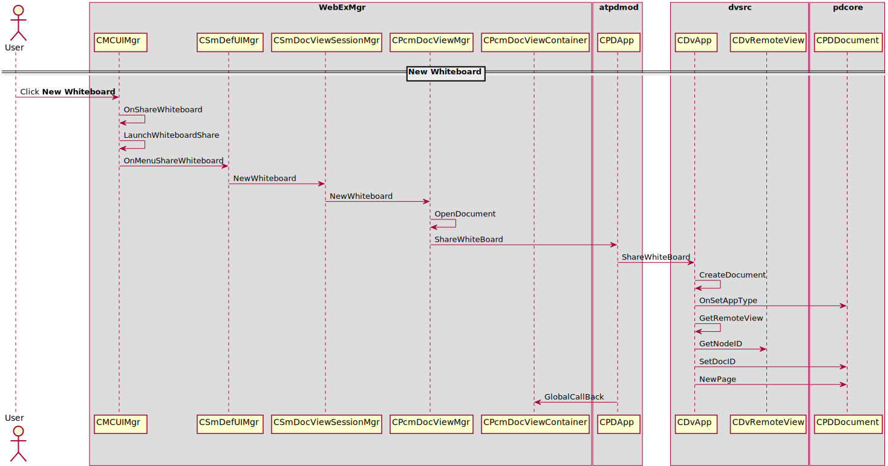

PD Whiteboard
=============

How to new a whiteboard
-----------------------

Sequence for new whiteboard 

Reference
---------

#. atpdmod.dll

   * \\020p\\src\\windows\\pdmod\\pdmod.vcxproj
   * Dependencies: dvsrc.lib, pdcore.lib

#. dvsrc.lib

   \\020p\\src\\common\\dvsrc\\dvsrc.vcxproj

#. pdcore.lib

   \\020p\\src\\common\\wpdf\\pdcore\\pdcore.vcxproj

#. atdocvu.dll 

   \\

#. UI relevant class

   * CPfwControlAutoSizeBtn
   * CPcmPdTabCtrlEx
   * CPcmDocViewMgr
   * CMCDocViewSessionMgr
   * CMCServiceMgr

#. CpfwPdEventSink::OnProcessPDCommand
#. IPDUIEvent
#. CMCPDUMgr::SendPrivilegeChangePDU
#. CMCPrivilegeDlg::OnCommand
#. CMCPrivilegeDlg::RefreshPresenterPrivilege

#. PD Toolbar

   * Toolbar Save
   
    + CPcmDocViewMgr EnableAnnoSaveButton
    + PD_COMMAND_TOOLBAR_SAVE
    
   * Allow annotation
   
    + CPfwPdProxy::ProcessCommand
    + PD_COMMAND_TOOLBAR_ALLOW_TO_ANNOTATE_USER
    + CMCDocViewSessionMgr::PrepareAllow2AnnotationUsers