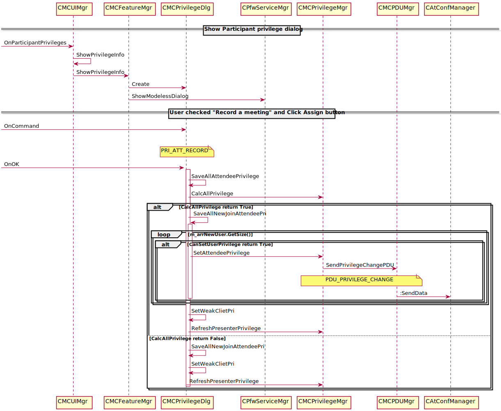
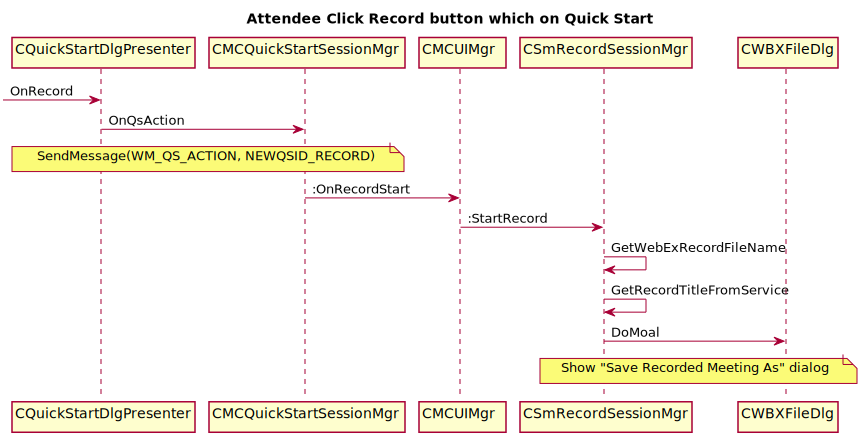

Record Privilege And Relevant UI
================================
This document will show you:

* How the presenter *'assign'* or *'withdraw'* **record privilege**
* How the attendee's UI behaviour will be changed when had assigned **record privilege**
* How the attendee's UI behaviour will be changed when had withdrawer **record privilege**.

Presenter *'assign'* or *'withdraw'* record privilege
---------------------------------------------
* Step1: Click *'Menu=>Participant=>Assign Privilege ...'*
* Step2: Show *'Participant privilege'* dialog
* Step3: In *'Participant privilege'* dialog, Click *'Participants'* tab
* Step4: In *'Participant'* tab, Check or UnCheck *'Record a meeting'* check box
* Step5: Then click **Assign** button 
Here is the sequence:

Show "Save Recored Meeting As" dialog
-------------------------------------
* Step1: Presenter assign the *'Record Privilege'* to attendee
* Step2: Attendee click *'Record'* button from *'Quick Start'*
* Step3: Show *'Save Recored Meeting As'* dialog

Here is the sequence show the call flow when the Attendee click *'Record'* from *'Quick Start'* :

Attendee receive a "withdraw record privilege" message
------------------------------------------------------
There are three case:

* Case1: Attendee without click **Record** from *Quick Start*
* Case2: Attendee clicked **Record** from *Quick Start*, and showed *'Save Recored Meeting As'* dialog
* Case3: Attendee had **Recored** the meeting
 
When presenter withdraw the attendee's privilege, here is the sequence at the attendee side

.. image:: _static/record_attendee_withdrawal_privilege_seq.svg

