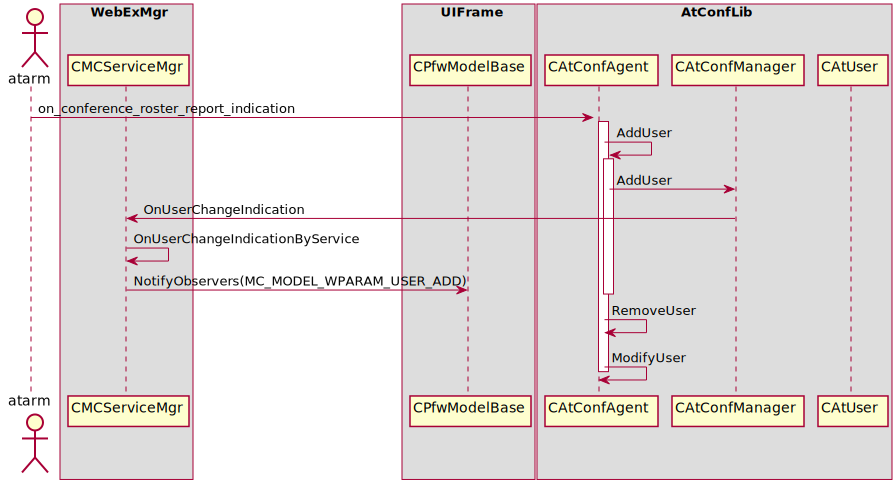

Roster
======

Roster
------

Sequence for roster 

Table for UIFrame
-----------------

#. WebExMgr

	- CMCAudioSessionMgr
	
		+ CMCPListUIMgr
	
	- CMCHybridAudioMgr
	
		+ CMCPListUIMgr
	
	- CMCPDUMgr
	
		+ CMCPListUIMgr
	
	- CMCServiceMgr
	
		+ CMCHostEndDlgForTrain
		+ CMCEndDialogWithDMS
		+ CMCPListUIMgr
		
	- CMCSvcVideoSessionMgr
	
		+ CMCPListUIMgr
	
	- CMCTelephoneMgr
	
		+ CMCPListUIMgr
	
	- CMCUIMgr
	
		+ CMCPListActiveTalkBar
		+ CMCPListUIMgr
	
	- CMCUserMgr
	
		+ CMCPListActiveTalkBar
		+ CMCPListUIMgr
	
	- CMCPDUMgr
	
		+ CMCPListUIMgr
	
	- CMCFeatureMgr
	
		+ CMCPListUIMgr
	

#. UIFrame

	- CPfwUIBaseInfoMgr
	
		+ CMCPListActiveTalkBar
		+ CMCPListLockListBar
		+ CMCPlistSelfBar
		+ CMCPListThumbNailView
		+ CMCPListVideoPanel
		+ CSmAgentWnd
		+ CDefUIBarPane
		+ CLockIconTooltipContainer
		+ CSmQuickStartSessionMgr
		+ CPfwFITPanelsView
		+ CPfwFITUIManager
		+ CPfwMainFrame
		+ CPfwMainPanelsView
		+ CPfwFloatTrayStatus
		+ CPfwRecordingMarkWnd
		+ CVUIActiveMainVideoPort
		+ CVUIFullScreenPanel
		+ CVUIMgr
		+ CVUIActivateMainSelfVideoPort
		+ CVUIThumbnailVideoPort
		+ CVUIThumbnailContainer
		+ CVUIWidgetVideoPort
	
	- CPfwFITIconsMgr
	
		+ CPfwFITIconsMgr
		+ CPfwFloatTrayWnd
	
	- CPfwPanelsMgr
	
		+ CMCPListActiveTalkBar
		+ CMCPListLockListBar
		+ CMCPlistSelfBar
		+ CMCPListThumbNailView
		+ CMCPListVideoPanel
		+ CMCUIMgr
	
	- CPfwUIRecordMgr
	
		+ CPfwFloatTrayStatus
	
	- CPfwUIAudioMgr
	
		+ CMCPlistSelfBar
		+ CVUIFullScreenPanel
	
	- CPfwUIVOIPMgr
	
		+ CPfwFloatTrayStatus
	
	- CPfwUIAppShareMgr
	
		+ CPcmASDrawToolCtrl
		+ CSmAgentWnd
		+ CPfwAsNoRemoteControlMapT
		+ CPfwAppShareMMMapT
		+ CPfwAsAnnotationBringToTopMapT
		+ CPfwAsMagicMapT
		+ CPfwControlShareBtnsContainer
		+ CPfwFloatTrayStatus
		+ CVUIVideoPortView
	
	- CPfwAudioMgr
	
		+ CMCPListActiveTalkBar
		+ CMCPListLockListBar
		+ CMCPListUIMgr
		+ CMCQuickStartSessionMgr
		+ CMCUserToolBar
		+ CSmFITUIMgr
		+ CPfwFloatTrayStatus
	
	- CPfwVideoMgr
	
		+ CMCPListActiveTalkBar
		+ CMCPListLockListBar
		+ CMCPlistSelfBar
		+ CMCPListThumbNailView
		+ CMCPListVideoPanel
		+ CMCUserToolBar
	
	- CPfwSVSMgr
	
		+ CVUIWidgetPanel
	
	- CPfwPSMgr
	- CPfwConfStatusMgr
	
		+ CVUIWidgetPanel
	
	- CPfwUIConfigMgr
	
		+ CVUIMgr
		+ CVUIThumbnailContainer
	

#. UserMgr

	- CPumUserMgrBase

#. VideoUI

	- CVUIMgr
	
		+ CVUIVideoPort
	

.. csv-table:: UIFrame
   :header-rows: 1 
   :stub-columns: 1
   :header: "WebExMgr", "ServiceMgr", "UIFrame" 
   :widths: 10, 10, 10

   "CMCAudioSessionMgr", "", "CPfwModelBase"
   "CMCHybridAudioMgr", "", "CPfwModelBase"
   "CMCPDUMgr", "", "CPfwModelBase"
   "CMCServiceMgr", "", "CPfwModelBase"
   "CMCSvcVideoSessionMgr", "", "CPfwModelBase"
   "CMCTelephoneMgr", "", "CPfwModelBase"
   "CMCUIMgr", "", "CPfwModelBase"
   "CMCUserMgr", "", "CPfwModelBase"
   "CMCPDUMgr", "", "CPfwModelBase"
