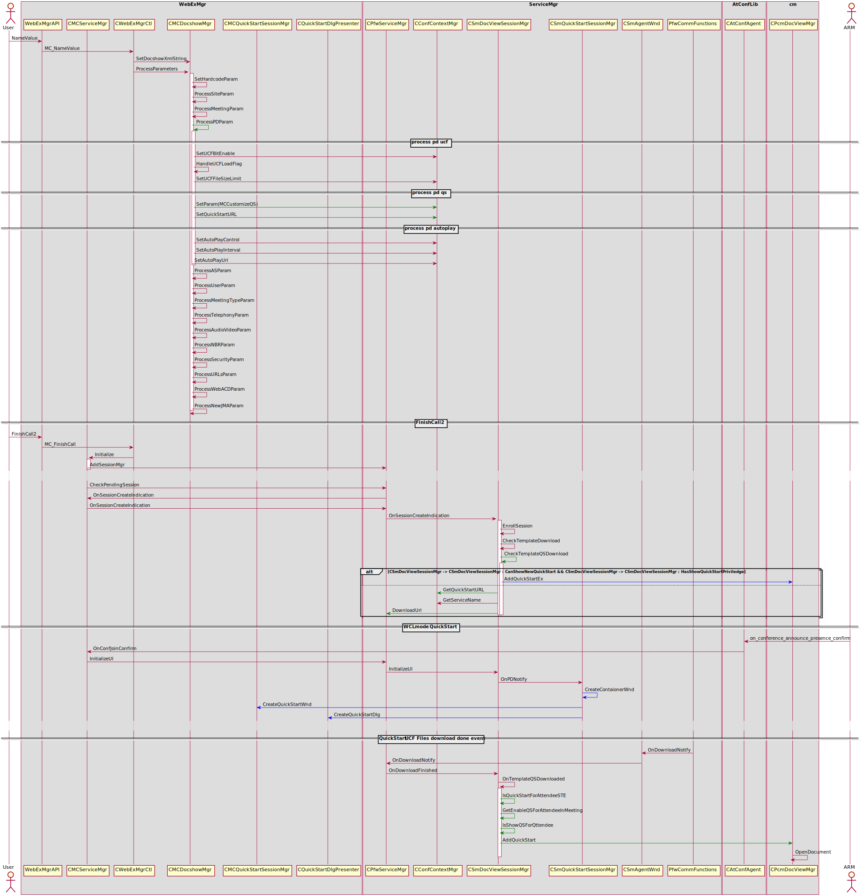
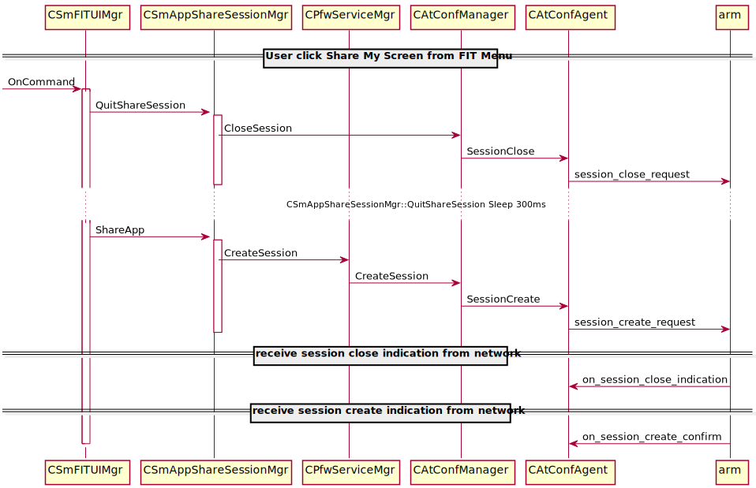

Anyone can share
================

Sequence for **QuickStart**
---------------------------

Sequence for **QuickStart** 

Sequence for **AS SwitchTo DS**
-------------------------------

Here will show you how switch to DS from AS

Where to enable **anyone can share**
------------------------------------

#. [Participant can grab presenter role] and [End-to-End] options in superadmin
#. [Allow Participants to Share in meetings (MC only)] in siteadmin options
#. webex.ini
#. clientparam
#. MeetingType
#. SiteConfigExt & 0x20000

ServiceMgr **Anyone can share** CConfContextMgr
-----------------------------------------------

#. SetEnableParticipantGrabPresenter
#. GetEnableParticipantGrabPresenter
#. $EnableParticipantGrabPresenter

CMCFeatureMgr
-------------

#. CanMakeMePresenter
#. MakeMePresenter
#. QueryMakePresenter
#. MakePresenterDirectly

	- CPfwServiceMgr::SetUserAsPresenter
	- CAtConfManager::SetUserAsPresenter
	- GCC_Provider_Secu::presentor_assign_request

Be make me presenter
--------------------

#. g_pMCServiceMgr->m_mcFeatureMgr.CanMakeMePresenter()
#. && ((g_pMCServiceMgr->m_Info.dwBitFlag & BIT_FLAG_ANYONE_CAN_SHARE) != BIT_FLAG_ANYONE_CAN_SHARE_DISABLE)

Be Any one share
----------------

#. g_pMCServiceMgr->m_mcFeatureMgr.CanMakeMePresenter() 
#. && ((g_pMCServiceMgr->m_Info.dwBitFlag & BIT_FLAG_ANYONE_CAN_SHARE) != BIT_FLAG_ANYONE_CAN_SHARE_DISABLE) 
#. && (CSmFeatureMgr::MP_MODE_ANYONE_CAN_SHARE)

Quick Start With UCF template **Key Point**
-------------------------------------------

#. Docshow customized **Quick Start**

	- QSCustomizedFlag
	- QSMD5
	- QSURL

#. CMCDocshowMgr::ProcessPDParam
#. CConfContextMgr::SetParam("MCCustomizeQS")
#. CConfContextMgr::SetQuickStartURL()
#. QS_ITEM_SHARE_APP_ICON
#. QS_ITEM_SHARE_DOC
#. CSmDocViewSessionMgr::CheckQSStatus
#. CMCQuickStartSessionMgr::CheckQSStatus
#. CSmQuickStartSessionMgr::CanShowNewQuickStart
#. CSmDocViewSessionMgr::ShowQSForAttendee
#. CSmDocViewSessionMgr::SetEnableQsForAttendeeInMeeting
#. CSmDocViewSessionMgr::OnQsAppShare
#. MP_MODE_ANYONE_CAN_SHARE
#. CSmDocViewSessionMgr::OnQSNoPrivilege
#. CMCDocViewSessionMgr::OnTemplateQSDownload

	- CSmDocViewSessionMgr::IsQuickStartForAttendeeSTE
	- CSmDocViewSessionMgr::GetEnableQSForAttendeeInMeeting
	- CSmDocViewSessionMgr::IsShowQSForAttendee
	- CPcmDocViewMgr::AddQuickStart

