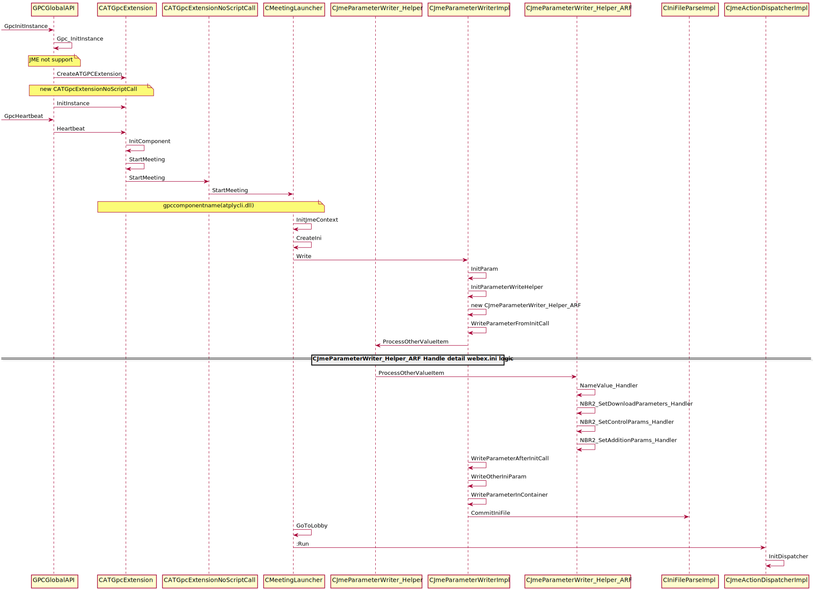

NBR Remove Script
=================

webex.ini template
------------------
::

 [WebEx]
 urlroot=
 localrootsectionver=
 gpcextver=
 gpcdecver=
 downloadmsgtitle=
 downloadlocalsetting=
 ininame=
 productroot=
 skip_download=
 HomePageURL=
 PlaybackURL1=
 PlaybackURL2=
 PlaybackBrowser=
 productname=
 controltype=
 Reserved0=
 Reserved1=
 Reserved2=
 Reserved3=
 Reserved4=
 Reserved5=
 Reserved6=
 Reserved7=
 Reserved8=
 Reserved9=
 Reserved10=
 Reserved11=
 [Vista]
 sectionnameEX=
 AppName_V=
 AppPara_V="-Online C:\Users\Lamfung\AppData\LocalLow\WebEx\webex.ini"
 [NameValue]
 SFSupporting=
 GpcMovingInSubdir=
 ClientBuildVersion=
 T29CryptoFlag=
 EnableCertChecking=

ARF remove script sequence
--------------------------

GPC Parameters
--------------

#. gpccomponentname
#. gpcinitcall
#. gpcexitcall
#. gpcactions
	+ GpcChangeLocation(szHomePage, szFrameName), Base64Decode(szhomepage), Base64Decode(szframename)
#. gpcerrorpageurl
#. szhomepage
#. szframename

#. WebEx
	+ urlroot=[gpcurlroot], HardCode(urlroot)=NoneDecode(gpcurlroot)
	+ localrootsectionver=[gpcproductversion],HardCode(localrootsectionver)=NoneDecode(gpcproductversion)
	+ gpcextver=[gpcextversion],HardCode(gpcextver)=NoneDecode(gpcextversion)
	+ gpcdecver=[gpcunpackversion],HardCode(gpcdecver)=NoneDecode(gpcunpackversion)
	+ downloadmsgtitle=[gpcprogressbartitle],HardCode(downloadmsgtitle)=Base64Decode(gpcprogressbartitle)
	+ downloadlocalsetting=[gpclocalsetting],HardCode(downloadlocalsetting)=Base64Decode(gpclocalsetting)
	+ ininame=[gpcinifilename],HardCode(ininame)=Base64Decode(gpcinifilename)
	+ productroot=[gpcproductroot],HardCode(productroot)=NoneDecode(gpcproductroot)
	+ None (hard code), skip_download=IsVista()?0:1,HardCode(skip_download)=IsVista()?0:1
	+ HomePageURL=[homepageurl], HardCode(HomePageURL)=Base64Decode(homepageurl)
	+ PlaybackURL1=[playbackurl1], HardCode(PlaybackURL1)=Base64Decode(playbackurl1)
	+ PlaybackURL2=[playbackur2], HardCode(PlaybackURL2)=Base64Decode(playbackur2)
	+ PlaybackBrowser=[browsertype], HardCode(PlaybackBrowser)=Base64Decode(browsertype)
	+ None (hard code), HardCode(productname)=HardCode(nbrpl)
	+ controltype=[controltype], HardCode(controltype)=Base64Decode(controltype)
	+ Reserved0=[reserved0], HardCode(Reserved0)=Base64Decode(reserved0)
	+ Reserved1=[reserved1], HardCode(Reserved1)=Base64Decode(reserved1)
	+ Reserved2=[reserved2], HardCode(Reserved2)=Base64Decode(reserved2)
	+ Reserved3=[reserved3], HardCode(Reserved3)=Base64Decode(reserved3)
	+ Reserved4=[reserved4], HardCode(Reserved4)=Base64Decode(reserved4)
	+ Reserved5=[reserved5], HardCode(Reserved5)=Base64Decode(reserved5)
	+ Reserved6=[reserved6], HardCode(Reserved6)=Base64Decode(reserved6)
	+ Reserved7=[reserved7], HardCode(Reserved7)=Base64Decode(reserved7)
	+ Reserved8=[reserved8], HardCode(Reserved8)=Base64Decode(reserved8)
	+ Reserved9=[reserved9], HardCode(Reserved9)=Base64Decode(reserved9)
	+ Reserved10=[reserved10], HardCode(Reserved10)=Base64Decode(reserved10)
	+ Reserved11=[reserved11], HardCode(Reserved11)=Base64Decode(reserved11)

#. Vista
	+ None (hard code), HardCode(sectionnameEX)=HardCode(WebEx_V) 
	+ None (hard code), HardCode(AppName_V)=HardCode(webex\\500\\nbrplay.exe)
	+ None (hard code), HardCode(AppPara_V)="-Online WebExIniFileFullPath" 
#. NameValue
	+ [paramname0]=[paramvalue0], Base64Decode(paramname0)=Base64Decode(paramvalue0)
	+ [paramname1]=[paramvalue1], Base64Decode(paramname1)=Base64Decode(paramvalue1)
	+ [paramname2]=[paramvalue2], Base64Decode(paramname2)=Base64Decode(paramvalue2)
	+ [paramname3]=[paramvalue3], Base64Decode(paramname3)=Base64Decode(paramvalue3)
	+ [paramname4]=[paramvalue4], Base64Decode(paramname4)=Base64Decode(paramvalue4)

Script Execute Sequence
-----------------------
::

 ExecuteScript: 
  szCookie = InitControl(%HWND);
  NBR2_SetDownloadParameters(szCookie,GpcProductVersion,GpcUrlRoot,GpcExtVersion,GpcUnpackVersion,GpcProgressBarTitle,GpcIniFileName,GpcProductRoot,GpcLocalSetting);
  NameValue(szCookie, ParamName0,ParamValue0);
  NameValue(szCookie, ParamName1,ParamValue1);
  NameValue(szCookie, ParamName2,ParamValue2);
  NameValue(szCookie, ParamName3,ParamValue3);
  NameValue(szCookie, ParamName4,ParamValue4);
  NBR2_SetAdditionParams(szCookie,homepageURL,playbackURL1,playbackURL2,browserType,lpszReserved1,lpszReserved2,lpszReserved3);
  NBR2_SetControlParams(szCookie,ControlType,Reserved0,Reserved1,Reserved2,Reserved3,Reserved4,Reserved5,Reserved6,Reserved7,Reserved8,Reserved9,Reserved10,Reserved11);
 ExecuteScript: 
  GpcChangeLocation(szHomePage, szFrameName);
 ExecuteScript: 
  ExitControl(szCookie);

	
atplycli.dll API
----------------

#. InitControl
#. ExitControl
#. NBR2_SetControlParams
	+ Execute Script
		- NBR2_SetControlParams(szCookie,ControlType,Reserved0,Reserved1,Reserved2,Reserved3,Reserved4,Reserved5,Reserved6,Reserved7,Reserved8,Reserved9,Reserved10,Reserved11);
	+ Write to webex.ini: [WebEx]
		#. productname=nbrpl
		#. controltype=[controltype]
		#. Reserved0=[reserved0]
		#. Reserved1=[reserved1]
		#. Reserved2=[reserved2]
		#. Reserved3=[reserved3]
		#. Reserved4=[reserved4]
		#. Reserved5=[reserved5]
		#. Reserved6=[reserved6]
		#. Reserved7=[reserved7]
		#. Reserved8=[reserved8]
		#. Reserved9=[reserved9]
		#. Reserved10=[reserved10]
		#. Reserved11=[reserved11]
#. NBR2_SetDownloadParameters
	+ Execute Script
		- NBR2_SetDownloadParameters(szCookie,GpcProductVersion,GpcUrlRoot,GpcExtVersion,GpcUnpackVersion,GpcProgressBarTitle,GpcIniFileName,GpcProductRoot,GpcLocalSetting)；
	+ SetDownloadParameters
		::
		 
		 WBXVoid WBXCallback NBR2_SetDownloadParameters(WBXLPCTSTR lpszCookie,
								   WBXLPCTSTR lpszLocalSecVer,
								   WBXLPCTSTR lpszUrlRoot,
								   WBXLPCTSTR lpszGpcExtVer,
								   WBXLPCTSTR lpszGpcDecVer,
								   WBXLPCTSTR lpszDownloadMsgTitle,
								   WBXLPCTSTR lpszReserved1,
								   WBXLPCTSTR lpszReserved2,
								   WBXLPCTSTR lpszReserved3)
	+ Write to webex.ini: [WebEx]
		#. urlroot=[gpcurlroot]
		#. localrootsectionver=[gpcproductversion]
		#. gpcextver=[gpcextversion]
		#. gpcdecver=[gpcunpackversion]
		#. downloadmsgtitle=[gpcprogressbartitle]
		#. downloadlocalsetting=[gpclocalsetting]
		#. ininame=[gpcinifilename]
		#. productroot=[gpcproductroot]
		#. skip_download=IsVista()?0:1
	+ Write to webex.ini: [Vista]
		#. sectionnameEX= WebEx_V 
		#. AppName_V= webex\\500\\nbrplay.exe
		#. AppPara_V="-Online WebExIniFileFullPath" 
#. NBR2_SetAdditionParams
	+ Execute Script
		- NBR2_SetAdditionParams(szCookie,homepageURL,playbackURL1,playbackURL2,browserType,lpszReserved1,lpszReserved2,lpszReserved3);
	+ Write to webex.in: [WebEx]
		#. HomePageURL=[homepageurl]
		#. PlaybackURL1=[playbackurl1]
		#. PlaybackURL2=[playbackur2]
		#. PlaybackBrowser=[browsertype]
#. NameValue

Code Change
-----------

#. atgpcext_win.cpp
	+ GetServiceType()
	+ CATGpcExtension::InitComponent()
#. JmeParameterWriterImpl.cpp
	+ CJmeParameterWriterImpl::InitParameterWriterHelper
#. GPCParamUtil.cpp
	+ szPrecompatibleParams

WRF
---

#. atauthor.exe
	+ https://bitbucket-eng-chn-sjc1.cisco.com/bitbucket/projects/CCTG/repos/webex-windows-localrecorder/browse
#. [gpccomponentname]=[QVRSQ1AuRExM]
	+ gpccomponentname, atrcp.dll
#. [gpcactions]=[IEdwY0NoYW5nZUxvY2F0aW9uKHN6SG9tZVBhZ2UsIHN6RnJhbWVOYW1lKTt8IHwgfCB8IHwgfCB8IHwgfCB8IHwgfA==]
	+ GpcChangeLocation(szHomePage, szFrameName);| | | | | | | | | | | |
#. [gpcinitcall]=[c3pDb29raWUgPSBJbml0Q29udHJvbF9BbGxJbk9uZSglSFdORCxHcGNMb2NhbFNldHRpbmcsQWxsSW5PbmVQYWNrYWdlRW5hYmxlKTtXZWJFeF9TZXRDb250cm9sVHlwZShzekNvb2tpZSxDb250cm9sVHlwZSxSZWNvcmRBZGRyZXNzKTs=]
    szCookie = InitControl_AllInOne(%HWND,GpcLocalSetting,AllInOnePackageEnable);WebEx_SetControlType(szCookie,ControlType,RecordAddress);
	
#. F6535 GPC Security - Remove Script Codes for SC,WRF,NBR
	https://wiki.cisco.com/pages/viewpage.action?pageId=109437735

Test Case
---------

ARF test case
~~~~~~~~~~~~~

#. Clean Package(gota70.eng.webex.com 32.10.0.142)

	.. csv-table:: ARF Remove Script(Clean Package 32.10.0.142)
   		:stub-columns: 1
   		:header: , "IE", "FireFox", "Chrome", "Edge"
   		:widths: 10, 10, 10, 10, 10
		
   		"Win7", IE9(9.0.8112.16421), FireFox(56.0.2), Chrome(63.0.3239.90), 
   		"Win8.1", IE11(11.0.9600.18618), FireFox(56.0), Chrome(63.0.3239.84), 
   		"Win10", IE11(11.64.16299.0), FireFox(57.0.1), Chrome(63.0.3239.84), 

#. Upgrade Package(cisco.webex.com 32.8.4.6=>32.10.0.142 gota70.eng.webex.com)

	.. csv-table:: ARF Remove Script(32.8.4.6=>32.10.0.142)
   		:stub-columns: 1
   		:header: , "IE", "FireFox", "Chrome", "Edge"
   		:widths: 10, 10, 10, 10, 10
		
   		"Win7", IE9(9.0.8112.16421), FireFox(56.0.2), Chrome(63.0.3239.90), 
   		"Win8.1", IE11(11.0.9600.18618), FireFox(56.0), Chrome(63.0.3239.84), 
   		"Win10", IE11(11.64.16299.0), FireFox(57.0.1), Chrome(63.0.3239.84), 

CDECT Issue
-----------

#. CSCvg08443, WRF Issue
	+ Created at 09/25/17 8:49
	+ Can't online playback wrf file again with ActiveX after playback with Java download method

WRF test case
~~~~~~~~~~~~~  

#. Clean Package(gota70.eng.webex.com 32.10.0.142)

	.. csv-table:: WRF Remove Script(Clean Package 32.10.0.142)
   		:stub-columns: 1
   		:header: , "IE", "FireFox", "Chrome", "Edge"
   		:widths: 10, 10, 10, 10, 10
		
   		"Win7", IE9(9.0.8112.16421), FireFox(56.0.2), Chrome(63.0.3239.90), 
   		"Win8.1", IE11(11.0.9600.18618), FireFox(56.0), Chrome(63.0.3239.84), 
   		"Win10", IE11(11.64.16299.0), FireFox(57.0.1), Chrome(63.0.3239.84), 

#. Upgrade Package(cisco.webex.com 32.8.4.6=>32.10.0.142 gota70.eng.webex.com)

	.. csv-table:: WRF Remove Script(32.8.4.6=>32.10.0.142)
   		:stub-columns: 1
   		:header: , "IE", "FireFox", "Chrome", "Edge"
   		:widths: 10, 10, 10, 10, 10
		
   		"Win7", IE9(9.0.8112.16421), FireFox(56.0.2), Chrome(63.0.3239.90), 
   		"Win8.1", IE11(11.0.9600.18618), FireFox(56.0), Chrome(63.0.3239.84), 
   		"Win10", IE11(11.64.16299.0), FireFox(57.0.1), Chrome(63.0.3239.84), 

